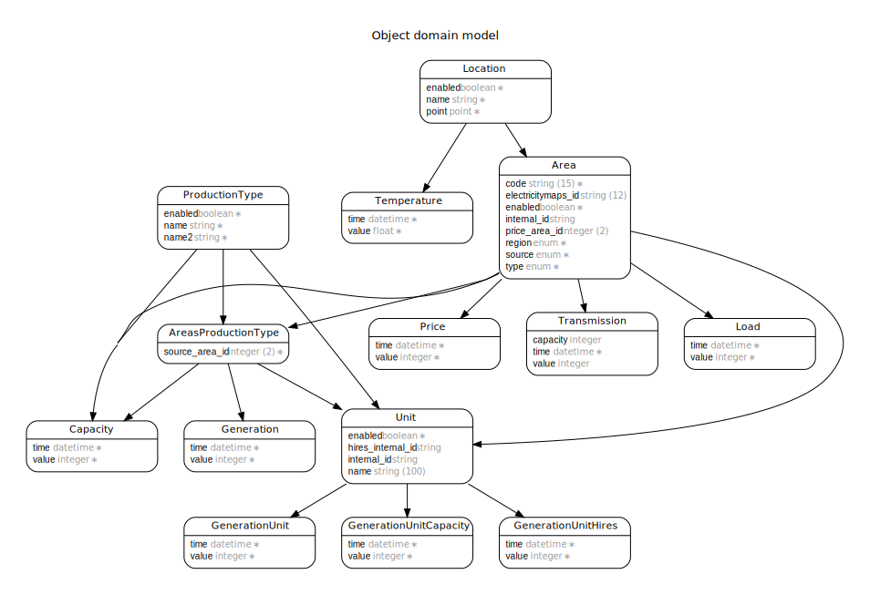

# intermittent.energy

## DB Schema

Units: kilowatt and celsius

### locations
A long/lat point associated to one or more areas.

### temperature
Temperatures in Celsius for a location

### regions
ENUM: europe, usa, australia, ...

### areas
code, enabled

A grid area which has generation/load/price data

### prices
historical prices for a grid area, without currency information

### production_type
name, name2, enabled

### areas_production_types
A pair of area_id and production_type_id - saves one column in generation_data.

### generation_data
Generation in kilowatt per areas_production_type_id

### generation_capacities

### transmission
from_area_id, to_area_id, value

a positive value should indicate a flow from in to out

### load (demand)

### units
an individual plant/unit

### generation_unit_hires
4 second generation unit data from AEMO

## Data Sources

### ENTSO-E
### EIA
### AEMO
### IESO
### Elexon
### ree.es
### TaiPower
### Tohoku-Epco
