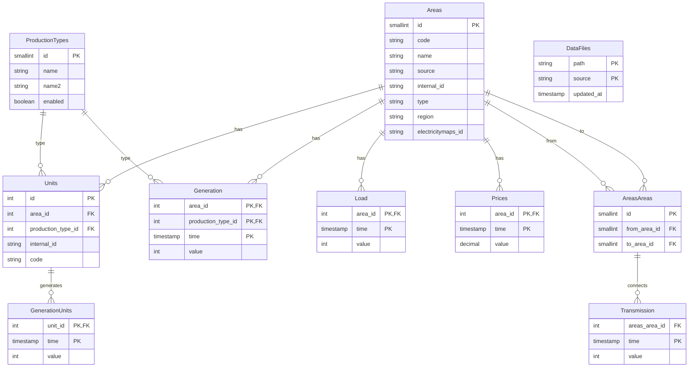

# Intermittent Energy Importers

Powers the analytics backend of [intermittent.energy/](https://intermittent.energy/), providing deep insights into global electricity markets and renewable energy integration.

A high-performance Ruby application for collecting, processing, and analyzing real-time power grid data worldwide. Built on PostgreSQL with [TimescaleDB](https://github.com/timescale/timescaledb/) for lightning-fast time series processing.

Follow [@IntermittentNRG](https://x.com/IntermittentNRG) for updates.

## Data Sources

🌎 **Americas**
- 🇺🇸 ⚡ [CAISO (California Independent System Operator)](lib/caiso.rb)
- 🇺🇸 🔋 [EIA (U.S. Energy Information Administration)](lib/eia.rb)
- 🇺🇸 💡 [ERCOT (Electric Reliability Council of Texas)](lib/ercot.rb)
- 🇺🇸 🔌 [NYISO (New York Independent System Operator)](lib/nyiso.rb)
- 🇨🇦 ⚡ [AESO (Alberta Electric System Operator)](lib/aeso.rb)
- 🇨🇦 🔋 [HYDRO-QUÉBEC](lib/hydro_quebec.rb)
- 🇨🇦 💡 [IESO (Independent Electricity System Operator - Ontario)](lib/ieso.rb)
- 🇨🇦 🔌 [NS Power (Nova Scotia Power)](lib/ns_power.rb)
- 🇧🇷 ⚡ [ANEEL (Brazilian Electricity Regulatory Agency)](lib/aneel.rb)
- 🇧🇷 🔋 [ONS (National System Operator - Brazil)](lib/ons.rb)
- 🇦🇷 💡 [CAMMESA (Wholesale Electricity Market Administrator - Argentina)](lib/cammesa.rb)

🌍 **Europe**
- 🇪🇺 ⚡ [ENTSOE (European Network of Transmission System Operators for Electricity)](lib/entsoe.rb)
- 🇬🇧 🔋 [ELEXON (GB Electricity Market)](lib/elexon.rb)
- 🇬🇧 💡 [National Grid ESO (Great Britain)](lib/national_grid.rb)
- 🇮🇪 🔌 [EIRGRID (Ireland's Electricity Grid Operator)](lib/eirgrid.rb)
- 🇪🇸 ⚡ [REE (Red Eléctrica de España)](lib/ree.rb)
- 🇸🇪 🔋 [SVK (Svenska Kraftnät - Sweden)](lib/svk.rb)
- 🇪🇺 💡 [NORDPOOL (Nordic Power Exchange)](lib/nordpool.rb)

🌏 **Asia-Pacific**
- 🇦🇺 ⚡ [AEMO (Australian Energy Market Operator)](lib/aemo.rb)
  - 🔌 [AEMO NEM](lib/aemo_nem.rb) - National Electricity Market
  - 🔋 [AEMO WEM](lib/aemo_wem.rb) - Western Australia
  - 💡 [AEMO NEM Archive](lib/aemo_nem_archive.rb) - Historical NEM data
- 🇦🇺 🔌 [OpenNEM (Australian National Electricity Market Data)](lib/opennem.rb)
- 🇹🇼 ⚡ [Taipower (Taiwan Power Company)](lib/taipower.rb)
- 🇯🇵 🔋 [Tohoku (Tohoku Electric Power Company - Japan)](lib/tohoku.rb)

🌍 **Africa**
- 🇿🇦 ⚡ [ESKOM (South Africa)](lib/eskom.rb)

### Utilities
- 🛠️ [AWS SQS Integration](lib/aws_sqs.rb)
- 🔄 [CLI Mixins](lib/cli_mixin.rb)
- 🎨 [Grafana Animation](lib/grafanimate.rb)
- ❌ [Empty Error Handler](lib/empty_error.rb)

## Contributing

Please read [CONTRIBUTING.md](CONTRIBUTING.md) for details on our code of conduct, and the process for submitting pull requests.

## License

- Ruby
- PostgreSQL with TimescaleDB extension
- Environment variables for API access and configuration:
  - `AESO_TOKEN` - Alberta Electric System Operator API token
  - `AESO_QUEUE_URL` - AWS SQS queue URL for AESO data processing
  - `EIA_TOKEN` - U.S. Energy Information Administration API token
  - `ELEXON_TOKEN` - GB Electricity Market API token
  - `ENTSOE_TOKEN` - ENTSOE API token
  - `ENTSOE_USER` - ENTSOE SFTP username
  - `ENTSOE_PASSWORD` - ENTSOE SFTP password
  - `ERCOT_PROXY_API_KEY` - ERCOT proxy API key
  - `ES_URL` - Elasticsearch URL for logging (optional)
  - `RAILS_ENV` - Environment name (development/test/production)
  - `TAIPOWER_QUEUE_URL` - AWS SQS queue URL for Taipower data processing

## Database Configuration

Database configuration should be specified in `db/config.yml`. The system uses ActiveRecord with TimescaleDB for time-series data storage.

## Testing

The project uses RSpec for testing. Tests can be run with:

```bash
bundle exec rspec
```

Test coverage is tracked using SimpleCov with Cobertura formatter.

## Technical Stack

- Ruby with YJIT enabled
- PostgreSQL with TimescaleDB extension for time-series data
- Semantic Logger for structured logging
- AWS SQS for queue processing
- Elasticsearch for logging (optional)
- Various HTTP clients (Faraday, HTTParty) for API access
- Fast parsers (FastJsonparser, FastestCSV) for efficient data processing

## Data Processing Components

The system includes several key components:

- Data collectors for each market operator
- Time zone handling for different regions using TZInfo
- Data validation and normalization
- Bulk data import capabilities
- Historical data processing
- Real-time data updates
- SFTP support for certain providers (e.g., ENTSOE)
- AWS SQS integration for queue-based processing
- Automatic data deduplication

## Output Formats

Data can be processed into various formats through the `Out2` module:

- Generation data by fuel type
- Unit capacity and details
- Transmission flows
- Price data
- Load/demand data
- Unit-level generation data
- Rooftop solar data (where available)

## Development

When contributing:

1. Write tests for new functionality (RSpec with VCR for HTTP mocking)
2. Follow existing code patterns for new market integrations
3. Use the provided CLI mixins for consistent command-line interfaces
4. Handle time zones appropriately using the TZ constants
5. Use the provided logging infrastructure (SemanticLogger)
6. Leverage the fast parsers (FastJsonparser, FastestCSV) for data processing
7. Follow the established data validation patterns

## Rake Tasks

The system provides various Rake tasks for data collection:

```bash
# ENTSOE data collection
rake entsoe:all              # Run all ENTSOE tasks
rake entsoe:generation       # Collect generation data
rake entsoe:load             # Collect load data
rake entsoe:price            # Collect price data
rake entsoe:transmission     # Collect transmission data

# ELEXON data collection
rake elexon:all              # Run all ELEXON tasks
rake elexon:fuelinst         # Collect fuel mix data
rake elexon:load             # Collect load data
rake elexon:unit             # Collect unit data

# Other market operators
rake aemo:all                # Run all AEMO tasks
rake nordpool:all            # Run all Nordpool tasks
```

## Database Schema

The system uses a TimescaleDB-powered PostgreSQL database with the following structure:



Key features of the schema:

1. **Time-Series Tables**
   - `generation`, `load`, `transmission`, `prices` - Core time-series data
   - Optimized with TimescaleDB hypertables
   - Compressed for efficient storage

2. **Reference Tables**
   - `areas` - Geographic/market regions
   - `production_types` - Types of power generation
   - `units` - Individual generation units
   - `areas_areas` - Area interconnections

3. **Tracking Tables**
   - `data_files` - Import tracking and deduplication

4. **Key Features**
   - Composite primary keys for time-series data
   - Foreign key constraints for data integrity
   - Specialized indices for time-range queries
   - Compression policies for historical data


